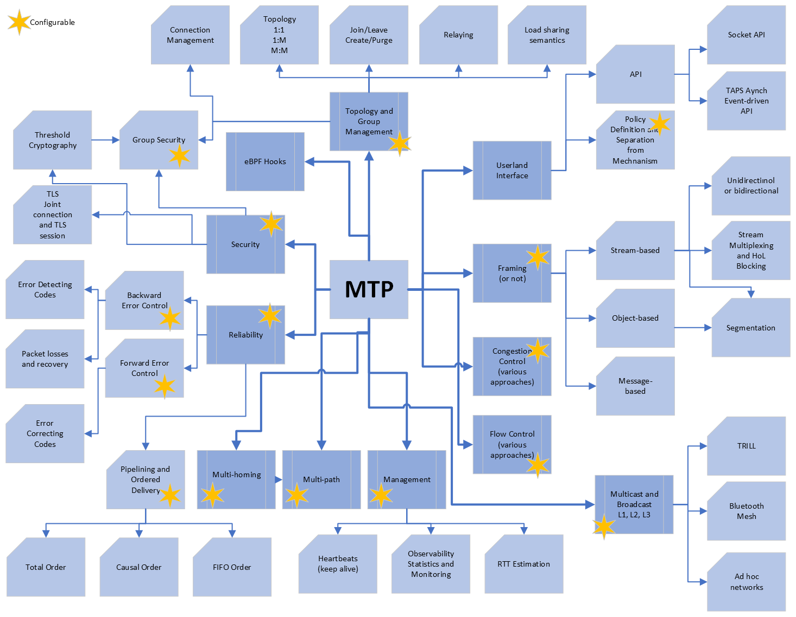

.. MTP: Mesh Transport Protocol documentation master file, created by
   sphinx-quickstart on Fri Dec  8 21:22:39 2023.
   You can adapt this file completely to your liking, but it should at least
   contain the root `toctree` directive.

MTP: Mesh Transport Protocol
========================================================

.. toctree::
   :maxdepth: 2
   :caption: Contents:

Introduction
~~~~~~~~~~~~
Although the Internet evolved as a robust network, many aspects are set
in stone causing ossification. Autonomous Systems block traffic other
than TCP and UDP. A consequence is the difficulty in extending routing
for multicasting and broadcasting. Another challenge is that the legacy
application layer protocols follow the client-server paradigm where only
a single client can communicate with a single server using legacy
transport layer protocols such as TCP or UDP. We call this approach
the single-client-to-single-server (SCSS) paradigm. Moreover, the
separation of policy from mechanism is not foreseen in present
transport layer protocols. The SCSS paradigm can be extended by
developing a transport layer protocol that helps a client communicate
with multiple servers concurrently which we refer to as mesh
transport protocol (MTP). We encounter mesh networks such as
Bluetooth Mesh Network or TRILL at various layers of the stack
across domains. However, there is no transport layer protocol
that leverages mesh networking technologies. In this project,
we will address this gap and design and develop a Mesh Transport
Protocol (MTP) separating policy from mechanism.

Why MTP?
~~~~~~~~

We briefly summarize the alternatives and the difference of MTP from these alternatives.

FLUTE/ALC (RFC6726) is a reliable multicast protocol implemented on UDP. It supports object-oriented data delivery to receiver groups and is not well adapted to byte or message streaming. FLUTE/ALC relies on IP multicasting. NORM (RFC5740) is another object-oriented multicast protocol exploiting IP multicast implemented on UDP. MTP will enable full duplex communication and cooperation among the client and servers.

TIPC (Transparent Inter Process Communication) is a protocol developed by Ericsson in Linux kernel to implement interprocess communication across machines in a cluster. TIPC implements service discovery and tracking in a cluster, supports multiple transmission modes over UDP and L2 services, and provides reliability in group communication. The RDS (Reliable Datagram Sockets) protocol provides reliable, sequenced delivery of datagrams over Infiniband or TCP and it is developed by Oracle. RDS provides reliable, ordered datagram delivery using a single reliable transport between two nodes. RDS uses TCP as the underlying transport, the application data is encapsulated in an RDS header and tunneled over TCP to the destination node at some well-known TCP port where it will be decapsulated. RUDP (Reliable UDP Protocol) is an RFC published by IETF and developed by Bell Labs. It extends the UDP functionality to introduce reliable datagram transport and flow control. While TIPS provide reliable group communication, RDS and RUDP still follows the SCSS paradigm. Moreover, TIPS is mostly confined to clusters. MTP will be a generic transport layer protocol that will implement an end-to-end reliable datagram and stream transport service without being confined to clusters.

Libp2p (https://libp2p.io) is a modular system of protocols, specifications, and libraries that enable the development of peer-to-peer network applications. Libp2p aims to be a modular, general-purpose toolkit for any peer-to-peer application. Libp2p uses the transport layer protocols (TCP, UDP, QUIC, etc.) and MTP may be employed under libp2p for efficient handling of one-to-many (and also many-to-many) communication.

Any Pub/Sub messaging queue (NSQ, NATS, 0MQ, RabbitMQ, etc.): These are mostly application layer systems (more than transport protocols). Our aim is to develop a transport layer protocol where the classical socket interface is extended partially to address one-to-many communication.

Multi-path Transport Layer Protocols (MPTCP, MRDS, SCCP, etc.) follow the SCSS paradigm exploiting multiple networking interfaces. MTP will exploit multiple interfaces, and further extend the concept of SCSS paradigm.

As we show in [mindmap]

Indices and tables
==================

* :ref:`genindex`
* :ref:`modindex`
* :ref:`search`
